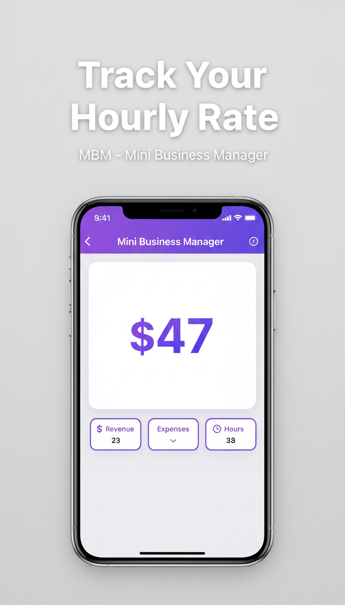
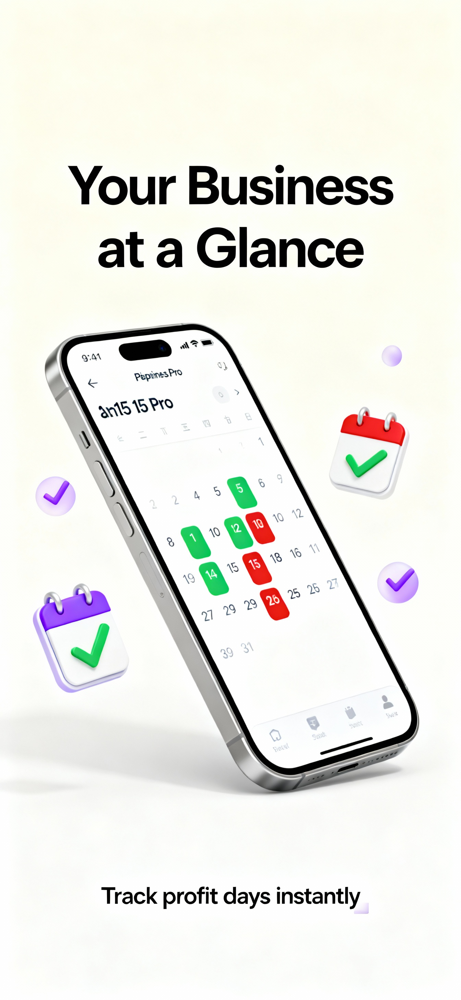

# MBM - Mini Business Manager

## Overview

MBM (Mini Business Manager) is a comprehensive iOS business management app designed specifically for small business owners, entrepreneurs, and freelancers who need powerful tools without the complexity of enterprise software.

## Features

- **Invoice & Expense Tracking**: Create professional invoices and track business expenses effortlessly
- **Customer Management**: Maintain detailed customer records and communication history
- **Financial Overview**: Real-time insights into revenue, expenses, and profitability
- **Task Management**: Organize business tasks and set reminders
- **Reports & Analytics**: Generate detailed business reports for informed decision-making
- **iCloud Sync**: Seamlessly sync your data across all your devices

## Screenshots

### Track Your Hourly Rate

### Syncs Across Your Devices

### Additional Features

## Technology

- Built with Swift and SwiftUI
- Native iOS experience
- Privacy-first: All data stays on your device with optional iCloud sync
- Optimized for iPhone and iPad

## Privacy

Your privacy matters. Read our [Privacy Policy](https://okekedev.github.io/MBM/privacy.html).

## Download

Coming soon to the App Store!

## License

Copyright © 2025 Christian Okeke. All rights reserved.
